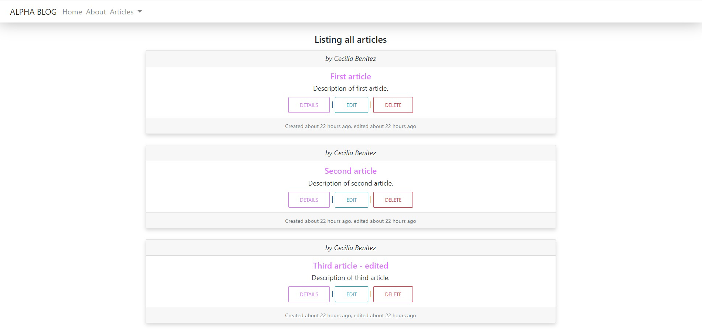
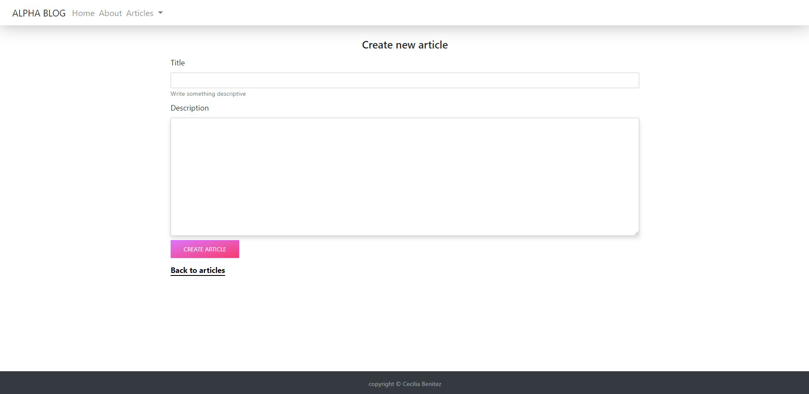

#  🧐 alpha-blog

This is the second project from the Rails module which consist in implementing a simple blog with some basic CRUD operations and follow the MVC patterns commonly used in Rails apps, in this blog we can make posts with a title and description, we can preview the posts list and post detail page, we can edit the post and finally we can delete the post.

## main views 
The most important view is the articles listing page.


We also have a form view to post a new article or edit.



## 🔧 Built With
- Ruby 2.6.6, Rails 6.0.3
- Using Rubocop Linters.
- sql3 DEV, postgreSQL PROD

## 🔴 Live Demo
[Live Demo Link](https://blogger-ceci.herokuapp.com/)

## 🛠 Getting Started
## Install 
Besides the live demo link, you can run those functions in you own local environment. In order to run, you need to install Ruby in your computer and the Rails framework. For windows you can go to [Ruby installer](https://rubyinstaller.org/) and for MAC and LINUX you can go to [Ruby official site](https://www.ruby-lang.org/en/downloads/) for intructions on how to intall it.
Then you can clone the project by typing ```https://github.com/Ceci007/alpha_blog.git```
To install Rails you just have to install it as a gem run the command ```gem install rails``` and then once you cloned this project run ```bundle install``` (you have to be located in the path were the Gemfile is).


To get a local copy up and running follow these simple example steps.

- Go to the main page of te repo.
- Press the "Code" button and get the repo link.
- Clone it using git.

## Run the server 
Once everything is set you can type ```rails server``` to start the server and go to https://localhost:3000 to view the web app and use it.

## ✒️ Author
👤 **Cecilia Benitez**

- Github: [@Ceci007](https://github.com/Ceci007)
- LinkedIn:[LinkedIn](https://www.linkedin.com/in/cecilia-ben%C3%ADtez-casaccia-498669185/)


## 🤝 Contributing
Contributions, issues and feature requests are welcome!

Feel free to check the [issues page](https://github.com/Ceci007/alpha_blog/issues).

## 📝 License
This project is [MIT](lic.url) licensed.
